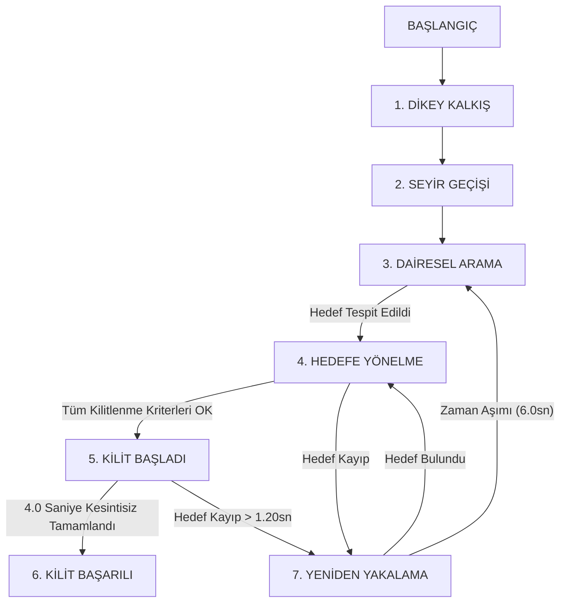
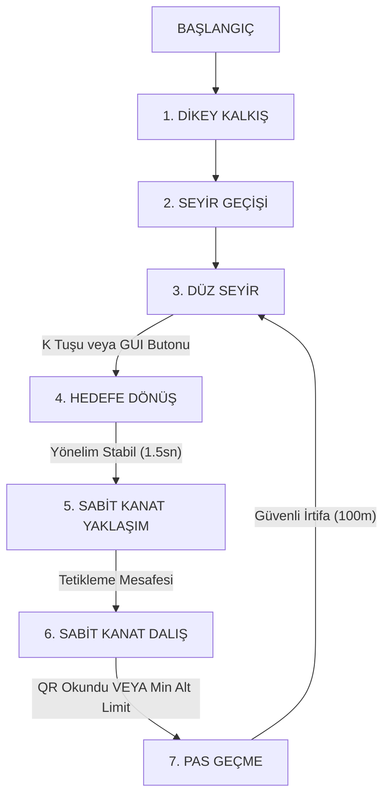

<h1 align="center">TEKNOFEST Savaşan İHA ve Otonom Kamikaze Görevleri</h1>

<p align="center">
  
  
  
  
  
  
</p>

---

<br>

## Proje Hakkında

Bu proje, **TEKNOFEST Savaşan İHA Yarışması** kapsamındaki otonom takip/kilitlenme ve otonom kamikaze görevlerinin yazılım altyapısını içerir.

Sistem testleri için dikey iniş kalkışlı **VTOL (Vertical Take-Off and Landing - QuadPlane)** tipi İHA modeli (`standard_vtol`) kullanılmıştır. Ancak projenin ana kodları **farklı tipteki İHA'lar** (sabit kanat, döner kanat vb.) ile çalışabilecek mimariye sahiptir. Kendi kullanacağınız İHA modeline uygun olarak `config.yaml` ve `default.yaml` dosyalarındaki parametreleri düzenleyip, gerekirse araç kontrol kodlarını da kendi aracınızın fiziksel uçuş dinamiklerine göre güncelleyerek sistemi kendi platformunuzda kullanabilirsiniz.

> [!NOTE]
> **📂 Medya Arşivi:** Uçuş testlerine ait orijinal yüksek çözünürlüklü video kayıtları, proje içerisindeki `./assets/` klasöründe yer almaktadır.

---

<br>

## ⚔️ Savaşan İHA Görevi: Otonom Takip ve Kilitlenme

<h3 align="center">🎥 Görev Önizleme Demosu</h3>

<p align="center">
  <video src="https://github.com/user-attachments/assets/05d4527f-3d3c-40fb-8e78-58eaf5a41bcb" controls width="800"></video>
</p>

<p align="center">
  📂 <b>Savaşan İHA Uçuş Kayıtları (Yerel Bağlantılar):</b><br>
  🎥 <a href="./assets/savaşan_iha.mp4">Özet/Kesilmiş Video</a> | 
  🎬 <a href="./assets/savaşan_iha_tam.mp4">Tam/Kesilmemiş Orijinal Video</a> | 
  ⚡ <a href="./assets/savaşan_iha_hızlı.mp4">Hızlandırılmış Test Videosu</a>
</p>

Savaşan İHA görevi; avcı aracın, havada devriye gezen av İHA'yı (prey) otonom olarak arayıp bulmasını, arkasına güvenli mesafeyle yerleşmesini (takip) ve şartnamede belirtilen 5 kriteri kesintisiz **4.0 saniye** boyunca sağlayarak kilitlenmesini kapsar.

### 📋 Şartname Kuralları & Kilitlenme Kriterleri
Yarışma kurallarına göre başarılı bir otonom kilitlenme için aşağıdaki 5 şartın aynı anda ve kesintisiz olarak **4.0 saniye** boyunca sağlanması gerekmektedir:

> [!IMPORTANT]
> **1. Boyut Şartı (`min_target_size_ratio`: %5)**
> Hedef İHA'nın genişlik/yükseklik değerinin kamera ekranına (1280x720) oranı **en az %5 (`0.05`)** olmalıdır.
> *   *Profil Telafisi & Güvenlik (`bbox_scale_factor: 0.80`):* Simülasyon testlerinde iki İHA aynı irtifada uçtuğu için avcı İHA avı tam arkadan (ince yanal kesit) görür. Bbox büyütülmediğinde %5 sınırının aşılması için avcı İHA'nın ava **2-3 metre kadar tehlikeli düzeyde** yaklaşması gerekir. Çarpışma ve kaybetme riskini engellemek için kutuyu sanal olarak %80 büyüten `bbox_scale_factor` eklenmiştir.
> *   *Yanal Kesit vs. Üstten Bakış Farkı:* Gerçek yarışmada avcı İHA ava **üst irtifadan** yaklaşacağından geniş kanat yüzey alanı kamerada tam görünür; bu dar profil sorunu yaşanmaz ve ham YOLO kutusuyla dahi kilitlenme güvenli mesafede sağlanır.

> [!NOTE]
> **2. Konum Şartı (Hedef Vuruş Alanı - `in_target_area`)**
> Hedef merkez noktası (`tcx, tcy`), ekran merkezindeki vuruş alanı sınırlarında olmalıdır (sağdan/soldan %25, alttan/üstten %10 pay: `target_area_margin_x: 0.25`, `target_area_margin_y: 0.10`).

> [!TIP]
> **3. Kilitlenme Alanı Şartı (Lock Zone - `in_lock_zone`)**
> Algoritmanın ürettiği kilitlenme dörtgeninin (kırmızı kutu) merkez koordinatı da Hedef Vuruş Alanı içerisinde yer almalıdır.

> [!WARNING]
> **4. Kapsama Oranı Şartı (Coverage Ratio - `coverage_ok`)**
> Kilitlenme dörtgeni, YOLO'nun tespit ettiği gerçek hedef kutusunun **en az %90'ını** kapsamalıdır (`min_coverage_ratio: 0.90`).

> [!CAUTION]
> **5. Merkez Kayma Toleransı (Center Offset - `center_offset_ok`)**
> Hedef kutusu merkezi ile kilitlenme dörtgeni merkezi arasındaki kayma sapması, hedefin kendi boyutunun **en fazla %50'si** kadar olabilir.

---

<br>

### ⚙️ Savaşan İHA Durum Makinesi (State Machine)

Uçuş kontrol mekanizması ve otonom takip görevleri bir durum makinesi (State Machine) üzerinden yönetilir:



#### Durumların Uçuş Algoritması:
1. **TAKEOFF (Dikey Kalkış):** İHA, kalkış yüksekliğine (`takeoff_altitude_m` - 100m) dikey motorlarla tırmanır.
2. **TRANSITION (Geçiş):** Sabit kanatlı uçuş motoru devreye girer ve düz seyir uçuşuna geçilir.
3. **CIRCLE\_SEARCH (Arama):** Arama merkezinde dairesel devriye atılarak YOLO ile hedef taranır.
4. **INTERCEPT (Yönelme & Takip):** Hedef bulunduğunda avcı burnunu hedefe çevirir ve PID hız kontrolüyle aradaki mesafeyi kapatır.
5. **LOCK\_HOLD (Kilitlenme Süreci):** 5 şart sağlandığında 4s sayaç başlar. Manevra ve anlık titreşimler için **1.20 saniyelik** kayıp toleransı (`hold_grace_time`) uygulanır.
6. **LOCK\_SUCCESS (Başarılı):** 4 saniye kesintisiz kilit tamamlandığında sunucuya veri gönderilir ve yeşil panelde **"GOREV BASARILI"** yazdırılır.
7. **REACQUIRE (Yeniden Yakalama):** Hedef anlık kaybedilirse EKF hız tahminiyle son bilinen konuma odaklanılır. 6 saniye içinde hedef bulunamazsa tekrar Arama moduna dönülür.

---

<br>

### 📐 Gelişmiş Algoritmik ve Kontrol Mimarisi

Sistem; nesne tespiti, durum kestirimi ve uçuş mekaniği kontrolünü birbirine bağlayan çok katmanlı bir mimariye sahiptir:

#### 1. YOLOv11 ile Gerçek Zamanlı Hedef Algılama
* **Derin Öğrenme Modeli:** Görüntü işleme adımında yüksek kare hızlarında (20+ FPS) av tespiti gerçekleştirmek için **YOLOv11** kullanılmıştır.
* > [!WARNING]
  > **Önemli Not:** Projede paylaşılan YOLO ağırlık dosyası Gazebo simülasyonu için eğitilmiş hafif bir **prototiptir**. Gerçek dünya uçuşlarında daha yüksek doğruluk ve menzil için **YOLOv11s** veya **YOLOv11m** modellerinin özgün veri kümeleriyle eğitilmesi tavsiye edilir.

#### 2. Extended Kalman Filter (EKF) Tracker
Görüntüdeki anlık kayıpları sönümlemek ve gürültülü YOLO çıktılarını filtrelemek amacıyla **Genişletilmiş Kalman Filtresi (EKF)** tabanlı tracker geliştirilmiştir.

* **Durum Vektörü:** Durum uzayı 6 boyuttan oluşur:

$$\mathbf{x} = \begin{bmatrix} x & y & u & v & w & h \end{bmatrix}^T$$

Burada $(x, y)$ hedef merkezini, $(u, v)$ piksel hızını, $(w, h)$ ise hedef kutu boyutunu temsil eder.

* **Dinamik Geçiş & Mahalanobis Gating:** Tahminler sabit hızlı dinamik modele dayanır:

$$\mathbf{x}\_{k} = F \mathbf{x}\_{k-1} + \mathbf{w}\_k$$

Hatalı tespitleri (gürültüleri) engellemek amacıyla **200 piksellik Mahalanobis Mesafe Eşiği (Gating)** uygulanır.

* **Tahminî Takip (Coasting):** Hedef anlık olarak kadrajdan çıktığında EKF kendi hız tahminiyle saniyede 25 kez güncellenerek takibin ve kilitlenme sayacının sıfırlanmasını önler.

#### 3. Görsel Servo (Visual Servoing) ve PID Kontrolü
Kamera üzerindeki piksel sapmalarını hava aracının fiziksel yönelim ve tırmanma hız komutlarına dönüştürür:

* **Açısal Projeksiyon:** Merkez piksel hataları ($e\_x, e\_y$), kamera FOV açıları ($FOV\_h = 110^{\circ}, FOV\_v = 75^{\circ}$) kullanılarak açı hatalarına ($\theta\_{\text{yaw}}, \theta\_{\text{pitch}}$) projekte edilir:

$$\theta\_{\text{yaw}} = \frac{c\_x - c\_{x,\text{mid}}}{c\_{x,\text{mid}}} \times \frac{FOV\_h}{2}$$

$$\theta\_{\text{pitch}} = \frac{c\_y - c\_{y,\text{mid}}}{c\_{y,\text{mid}}} \times \frac{FOV\_v}{2}$$

* **Sanal İrtifa Kestirimi:** Bbox genişlik oranı ($$\large w_r = \frac{w}{\text{frame width}}$$) ile yaklaşık geometrik mesafe ($d\_{est}$) kestirilir ve trigonometrik olarak irtifa farkı ($h\_{err}$) hesaplanır:

$$h\_{err} = d\_{est} \times \sin(\theta\_{\text{pitch}})$$

* **Çift PID Döngüsü:**
  * **Yatay Kontrol (`yaw`):** Açısal hata PID döngüsüne sokularak ArduPilot için pürüzsüz `yaw_rate` komutları üretilir.
  * **Dikey Kontrol (`vz`):** İrtifa hatası $h\_{err}$ dikey PID ile dikey hız (`vz` - m/s) komutuna dönüştürülür.

#### 4. Logaritmik Mesafe Kontrolü ve Hız Sınırlandırıcılar
Aşırı yaklaşmayı ve avı geçip gitmeyi (fly-past) önlemek amacıyla logaritmik hız profilleyici çalışır:

* **Logaritmik Hata:** Mesafe hatası, istenen ve mevcut genişlik oranlarının logaritmik farkından hesaplanır:

$$e\_{dist} = \ln\left(\frac{w\_{desired}}{w\_{current}}\right)$$

* **Hız Profilleyici & Slew Limiting:** Mesafe azaldıkça hız güvenli limitlere (6.0 - 8.0 m/s) çekilir. Aerodinamik aşırı yükleri engellemek için ani hız ve dönüş değişimleri sınırlandırılır (`max_speed_delta`, `max_yaw_delta`).

---

<br>

## 🎯 Kamikaze İHA Görevi ve Şartname Gereksinimleri

<h3 align="center">🎥 Görev Önizleme Demosu</h3>

<p align="center">
  <video src="https://github.com/user-attachments/assets/0b897603-f90d-4f7a-a46d-a202249760b8" controls width="800"></video>
</p>

<p align="center">
  📂 <b>Kamikaze Uçuş Kayıtları (Yerel Bağlantılar):</b><br>
  🎬 <a href="./assets/kamikaze.mp4">Normal Hızlı / Yavaş Video</a> | 
  ⚡ <a href="./assets/kamikaze_hızlı.mp4">Hızlandırılmış Test Videosu</a>
</p>

Kamikaze İHA görevi; yer düzlemindeki **2m x 2m** boyutundaki QR kod hedefinin dalış yapılarak kamerayla tespit edilmesi, okunması ve ardından güvenli irtifada pas geçilerek otonom uçuşa devam edilmesini kapsar.

### 📋 Şartname Kuralları & Görev Tanımı
* **Fiziki Çarpma Yasaktır:** QR kod okunmalı ancak platforma fiziki olarak çarpılmamalıdır.
* **Dalış İrtifası:** Dalışa başlama yüksekliği pist referansına göre en az **100 metre** olmalıdır.
* **Açılı Koruma Panelleri:** QR kodun etrafı 3m yüksekliğinde 45° açılı levhalarla çevrilidir. Bu nedenle İHA'nın üstten belli bir süzülüş açısıyla (glide slope) dalış yapması zorunludur.
* **Hedef Vuruş Alanı:** Dalışın sonlandığı anın 1s öncesi ve 1s sonrasını kapsayan 2 saniyelik dilimde, QR kodun tamamı ekran merkezindeki hedef vuruş alanında bulunmalı ve başarıyla çözülmelidir.

---

<br>

### ⚙️ Kamikaze İHA Durum Makinesi (State Machine)

Uçuş kontrol mekanizması bir durum makinesi (State Machine) üzerinden otonom olarak yönetilir:



#### Durumların Uçuş Algoritması:
1. **TAKEOFF (Dikey Kalkış):** İHA dikey olarak `takeoff_altitude_m` (150m) irtifaya tırmanır.
2. **TRANSITION (Geçiş):** Kalkış sonrası yatay uçuş motoru açılır ve dalış planlayıcı (`DiveGuidance`) başlatılır.
3. **CRUISE\_FORWARD (Seyir):** Operatör OpenCV arayüzünden dalış komutu verene (veya "K" tuşuna basana) kadar İHA belirlenen irtifada düz seyirde bekler.
4. **TURN\_TO\_TARGET (Yönelme):** Dalış tetiklendiğinde İHA hedef koordinata doğru U dönüşü yapar. Yönelim 1.5s boyunca kararlı kaldığında rota kilitlenir.
5. **FW\_APPROACH (Sabit Kanat Yaklaşımı):** İHA dalış kapısına kadar `GUIDED` modda irtifasını korur. Kapıdan geçince `FBWA` uçuş moduna geçerek motor ve kanat kararlılığı sağlar.
6. **FW\_DIVE (Dalış):** Burun aşağı 30° dalış gerçekleştirilir.
   * **Glide Slope PI:** İdeal süzülüş hattından sapmaları önlemek amacıyla PI kontrolcü `pitch_pwm` değerini kontrol eder.
   * **Yanal Sabitleme:** Rüzgardan savrulmayı önlemek için roll hareketleri sınırlandırılır (`dive_roll_limit_pwm`).
7. **PULLUP (Pas Geçme):** QR kod okunduğunda veya acil durum limitine (`dive_recovery_altitude_m` - 25m) girildiğinde dalış anında kesilir. Dikey motorlar çalıştırılarak hızlıca tırmanışa geçilir ve seyir durumuna güvenle geri dönülür.

---

<br>

## 🛠️ Simülasyon Ortamı ve Proje Kurulumu

### Ön Gereksinimler
Docker tabanlı simülasyon ortamı için kurulum adımları **[ArduGazeboSim-Docker](https://github.com/koesan/ArduGazeboSim-Docker)** deposundaki dokümantasyon takip edilerek gerçekleştirilmelidir. Bu kurulum; ROS paketleri, ArduPilot SITL ve Gazebo simülasyon ortamının tüm bağımlılıklarını otomatik olarak yapılandırır.

### 1. Sistem Bağımlılıklarının Kurulması
`PyZBar` kütüphanesinin çalışabilmesi için gerekli sistem kütüphanelerini kurun ve Python paketlerini yükleyin:

```bash
# Sistem kütüphanelerini güncelleyin ve libzbar paketlerini yükleyin
sudo apt-get update
sudo apt-get install -y libzbar0 libzbar-dev

# Gerekli Python kütüphanelerini yükleyin
pip install -r requirements.txt
```

### 2. Simülasyon Dosyalarının Kopyalanması

#### A. Kamikaze İHA Görevi Simülasyon Modelleri ve Dünyası
Proje klasöründeki özel modelleri ve dünyayı Gazebo simülasyon ortamına (catkin çalışma alanına) kopyalayın:

```bash
# Simülasyon modellerini kopyalayın
cp -rf ./Kamikaze_İHA_Görevi/similasyon/kamikaze_qr_target ./catkin_ws/src/iq_sim/models/
cp -rf ./Kamikaze_İHA_Görevi/similasyon/standard_vtol ./catkin_ws/src/iq_sim/models/

# Dünyayı (World) kopyalayın (Varsa üzerine yazar)
cp -f ./Kamikaze_İHA_Görevi/similasyon/multi_drone.world ./catkin_ws/src/iq_sim/worlds/
```

#### B. Savaşan İHA Görevi Simülasyon Modelleri ve Dünyası
```bash
# Simülasyon modellerini kopyalayın
cp -rf ./Savaşan_İHA_Görevi/similasyon/standard_vtol_1 ./catkin_ws/src/iq_sim/models/
cp -rf ./Savaşan_İHA_Görevi/similasyon/standard_vtol_2 ./catkin_ws/src/iq_sim/models/

# Dünyayı (World) kopyalayın (Eğer multi_drone.world yoksa kopyalar)
cp -n ./Savaşan_İHA_Görevi/similasyon/multi_drone.world ./catkin_ws/src/iq_sim/worlds/
```

### 3. ArduPilot Yapılandırması ve Parametre Tanımlamaları
Gazebo QuadPlane modellerinin ArduPilot SITL tarafından tanınması için `vehicleinfo.py` dosyasına `"gazebo-quadplane"` profilinin eklenmesi gerekmektedir. Hazır yapılandırılmış dosyaları ilgili ArduPilot klasörlerine kopyalayın:

#### A. Kamikaze İHA Yapılandırması
```bash
# Hazır parametre dosyasını default_params klasörüne kopyalayın
cp ./Kamikaze_İHA_Görevi/similasyon/gazebo_quadplane.parm ./ardupilot/Tools/autotest/default_params/gazebo_quadplane.parm

# vehicleinfo.py dosyasını güncelleyin (gazebo-quadplane profilini içerir)
cp ./Kamikaze_İHA_Görevi/similasyon/vehicleinfo.py ./ardupilot/Tools/autotest/pysim/vehicleinfo.py
```

#### B. Savaşan İHA Yapılandırması
```bash
# Hazır parametre dosyasını default_params klasörüne kopyalayın
cp ./Savaşan_İHA_Görevi/similasyon/gazebo_quadplane.parm ./ardupilot/Tools/autotest/default_params/gazebo_quadplane.parm

# vehicleinfo.py dosyasını güncelleyin (gazebo-quadplane profilini içerir)
cp ./Savaşan_İHA_Görevi/similasyon/vehicleinfo.py ./ardupilot/Tools/autotest/pysim/vehicleinfo.py
```

> [!NOTE]
> `vehicleinfo.py` içindeki ekleme `ArduPlane` yapısı altında şu şekilde tanımlanmıştır:
> ```python
> "gazebo-quadplane": {
>     "waf_target": "bin/arduplane",
>     "default_params_filename": "default_params/gazebo_quadplane.parm",
> },
> ```

---

<br>

## 🚀 Sistemi Çalıştırma Adımları

Uygulamak istediğiniz göreve göre aşağıdaki adımları sırasıyla gerçekleştiriniz:

### 🎯 Seçenek A: Kamikaze İHA Görevi Çalıştırma
Görevi çalıştırmak için sırasıyla **3 ayrı terminal** açmanız gerekmektedir:

#### 1. Terminal: Gazebo Simülasyonunu Başlatma
```bash
roslaunch iq_sim multi_drone.launch
```

#### 2. Terminal: ArduPilot SITL Bağlantısını Kurma
```bash
sim_vehicle.py -v ArduPlane -f gazebo-quadplane --no-mavproxy -I0
```

#### 3. Terminal: Görev Kontrol Yazılımını Başlatma
```bash
cd ./Teknofest_savaşan_iha/Kamikaze_İHA_Görevi/
python3 main.py
```

---

### ⚔️ Seçenek B: Savaşan İHA Görevi Çalıştırma (Otonom Takip ve Kilitlenme)
Görevi çalıştırmak için sırasıyla **4 ayrı terminal** açmanız gerekmektedir:

#### 1. Terminal: Gazebo Simülasyonunu Başlatma (Çoklu Drone Dünyası)
```bash
roslaunch iq_sim multi_drone.launch
```

#### 2. Terminal: ArduPilot SITL 1. Drone Bağlantısını Kurma (Avcı İHA - Hunter)
```bash
sim_vehicle.py -v ArduPlane -f gazebo-quadplane --no-mavproxy -I0
```

#### 3. Terminal: ArduPilot SITL 2. Drone Bağlantısını Kurma (Av İHA - Prey)
```bash
sim_vehicle.py -v ArduPlane -f gazebo-quadplane --no-mavproxy -I1
```

#### 4. Terminal: Görev Kontrol Yazılımını Başlatma
```bash
cd ./Teknofest_savaşan_iha/Savaşan_İHA_Görevi/
python3 main.py
```

---

<br>

## ⚙️ Önemli Konfigürasyon Parametreleri (`config.yaml` & `default.yaml`)

Tüm sistem parametreleri ilgili klasörlerdeki konfigürasyon dosyalarından yönetilir.

### A. Kamikaze İHA Görevi Parametreleri (`Kamikaze_İHA_Görevi/config.yaml`)

| Parametre Grubu | Değişken Adı | Varsayılan Değer | Açıklama |
| :--- | :--- | :--- | :--- |
| **vehicle** | `takeoff_altitude_m` | `150.0` | Otonom kalkışta çıkılacak hedef irtifa (metre) |
| | `cruise_altitude_m` | `150.0` | Seyir uçuşu gerçekleştirilecek irtifa (metre) |
| | `cruise_speed_mps` | `18.0` | Seyir uçuşu hızı (m/s) |
| | `min_safe_altitude_m` | `20.0` | Kritik güvenlik irtifa limiti (metre) |
| **mission** | `effective_dive_angle_deg` | `18.0` | Dalış mesafesi hesabı için süzülüş açısı (derece) |
| | `dive_angle_deg` | `30.0` | Dalış esnasında hedeflenen fiziki dalış açısı (derece) |
| | `dive_recovery_altitude_m` | `25.0` | Dalıştan çıkış (pull-up/pas geçme) tetikleme irtifası (metre) |
| | `pullup_target_altitude_m` | `100.0` | Pas geçtikten sonra tırmanılacak güvenli irtifa (metre) |
| | `target_offset_m` | `8.0` | QR hedefine olan yatay ofset mesafesi (metre) |
| **camera** | `primary_topic` | `/uav1/camera_front/image_raw` | ROS Kamera görüntüsü topic adı |

<br>

### B. Savaşan İHA Görevi Parametreleri (`Savaşan_İHA_Görevi/config/default.yaml`)

| Parametre Grubu | Değişken Adı | Varsayılan Değer | Açıklama |
| :--- | :--- | :--- | :--- |
| **lock** | `min_target_size_ratio` | `0.05` | Kilitlenme için minimum hedef en/boy oranı (%5) |
| | `bbox_scale_factor` | `0.80` | Kesit alanı dar profil telafisi için yapay bbox büyüme oranı (%80) |
| | `required_lock_duration` | `4.0` | Kilitlenmenin başarılı sayılması için gereken süre (saniye) |
| | `hold_grace_time` | `1.20` | Anlık kayıpları tolere eden esnek tolerans süresi (saniye) |
| | `target_area_margin_x` | `0.25` | Hedef vuruş alanı için sol/sağ ekran kırpma oranı (%25) |
| | `target_area_margin_y` | `0.10` | Hedef vuruş alanı için üst/alt ekran kırpma oranı (%10) |
| **control** | `desired_width_ratio` | `0.055` | İHA'nın avın arkasında korumak istediği hedef mesafe oranı |
| | `yaw_kp` / `yaw_kd` | `5.5` / `6.0` | Yönelim PID kazançları (Görsel Servo) |
| | `alt_kp` / `alt_kd` | `4.0` / `2.0` | İrtifa PID kazançları |
| | `fwd_kp` | `3.5` | Mesafe/hız PID kazancı |

<br>

> [!NOTE]
> **💡 Kilitlenme Genişletme Faktörü (`bbox_scale_factor`) Kullanımı:**
> *   `0.80` varsayılan değeri, algılanan hedef İHA kutusunu sanal olarak **%80 oranında büyüterek** (yani `1.80` katı) dar gövde kesitlerinde kilitlenme kriterinin erkenden sağlanmasını kolaylaştırır.
> *   Eğer yapay büyütme yapılmasını istemiyorsanız ve tamamen **ham YOLO tespit kutusu** ile şartname kontrolü gerçekleştirmek istiyorsanız, bu parametreyi `0.0` yapmanız yeterlidir. Bu durumda sistem %100 orijinal YOLO çıktılarını baz alacaktır.
