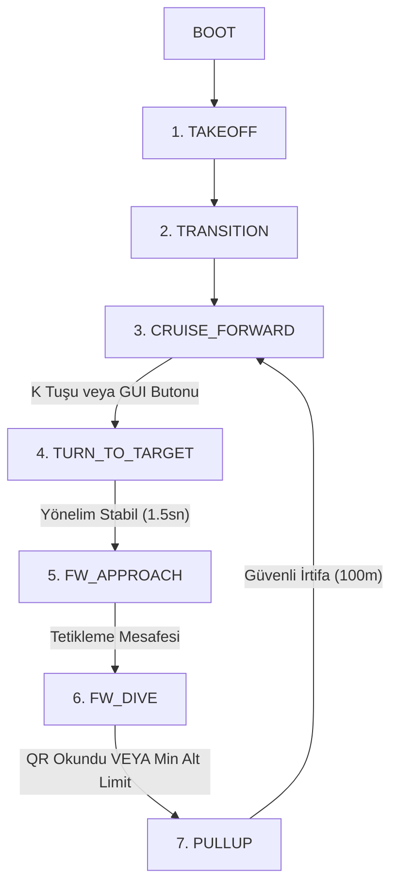

# 🚀 TEKNOFEST Savaşan İHA — Otonom Kamikaze & Takip Sistemi

Bu proje, **TEKNOFEST Savaşan İHA Yarışması** için geliştirilmiş otonom kamikaze görevi ve otonom takip/kilitlenme görevlerinin yazılım altyapısını içermektedir.

Sistem testleri için dikey iniş kalkışlı **VTOL (Vertical Take-Off and Landing - QuadPlane)** tipi İHA modeli (`standard_vtol`) kullanılmıştır. Ancak projenin ana kodları tamamen modüler ve esnek bir yapıda geliştirilmiş olup, **farklı tipteki İHA'lar** (sabit kanat, döner kanat vb.) ile çalışabilecek mimariye sahiptir. Kendi kullanacağınız İHA modeline uygun olarak `config.yaml` dosyasındaki parametreleri düzenleyip, gerekirse araç kontrol kodlarını da kendi aracınızın fiziksel uçuş dinamiklerine göre güncelleyerek sistemi kendi platformunuzda kullanabilirsiniz (yalnızca konfigürasyon dosyasındaki parametreleri değiştirmek yeterli olmayabilir).

---

## 🎯 Kamikaze İHA Görevi ve Şartname Gereksinimleri

Yarışma şartnamesine göre Kamikaze İHA görevi; yer düzleminde sabit bir konumda bulunan **2m x 2m** boyutlarındaki bir QR kod hedefinin İHA üzerindeki kamera ile otonom olarak tespit edilmesini, okunmasını ve ardından İHA'nın güvenli bir şekilde pas geçerek (tırmanışa geçerek) uçuşuna devam etmesini kapsar.

### 📋 Şartname Kuralları & Görev Tanımı
*   **Fiziki Çarpma Yasaktır:** İHA'nın hedef platforma fiziki olarak çarpması yasaktır. Amaç, dalış gerçekleştirip QR kodu kamerayla okumak ve güvenli bir irtifada pas geçmektir.
*   **Dalış Başlangıç İrtifası:** Şartname gereğince dalışa başlama irtifası, kalkış pistine göreli olarak **en az 100 metre** olmalıdır.
*   **Açılı Koruma Panelleri:** QR kodun düz uçuş (cruise) esnasında uzaktan ve düz karşıdan okunmasını engellemek amacıyla etrafı **3 metre yüksekliğinde ve 45 derece açılı** plakalarla çevrilmiştir. Bu nedenle İHA, yukarıdan belirli bir süzülüş açısıyla (glide slope) dalış yapmak zorundadır.
*   **Hedef Vuruş Alanı (Target Hit Area):** Dalışın sonlandığı (QR kodun okunduğu veya dalıştan çıkıldığı) andan 1 saniye önce ve 1 saniye sonraki (toplam 2 saniyelik) zaman diliminde, kameradan alınan en az 1 karede QR kod sınırlarının tamamı ekranın ortasındaki hedef vuruş alanı sınırları içerisinde olmalı ve en az 1 karede QR kod başarıyla çözülmüş olmalıdır.

---

## ⚙️ Sistem Çalışma Prensibi & Durum Makinesi (State Machine)

Uçuş kontrol mekanizması bir durum makinesi (State Machine) üzerinden otonom olarak yönetilir:



### Durumların Detaylı Analizi ve Uçuş Algoritması

1.  **TAKEOFF (Dikey Kalkış):** İHA, `GUIDED` modda dikey motorlarını (VTOL) çalıştırarak kalkış yapar ve konfigüre edilen kalkış yüksekliğine (`takeoff_altitude_m` - Varsayılan: 150m) dikey olarak tırmanır.
2.  **TRANSITION (Seyir Moduna Geçiş):** Kalkış tamamlandıktan sonra uçuş kontrolörü, kalkış yapılan konumu (veya konfigürasyondaki hedef koordinatlarını) hedef olarak kaydeder ve süzülüş/dalış parametrelerini hesaplamak üzere `DiveGuidance` sistemini başlatır.
3.  **CRUISE_FORWARD (Seyir Uçuşu):** İHA belirlenen seyir irtifasında (`cruise_altitude_m` - Varsayılan: 150m) düz ileri uçuş gerçekleştirir. Operatör OpenCV arayüzündeki **"START KAMIKAZE"** butonuna tıklayana veya klavyeden **"K"** tuşuna basana kadar bu durumda bekler.
4.  **TURN_TO_TARGET (Hedefe Yönelme):** Kamikaze görevi başlatıldığında İHA, `GUIDED` modda hedef koordinatına doğru keskin bir U dönüşü yapar. İHA'nın yönelimi (heading), hedef açısı toleransı (`heading_tolerance_deg`) içinde **1.5 saniye** boyunca kararlı kaldığında yönelim kilitlenir ve bir sonraki aşamaya geçilir.
5.  **FW_APPROACH (Sabit Kanat Yaklaşımı):** İHA dalış kapısına yaklaşırken erken irtifa kayıplarını önlemek amacıyla dalış sınırına (`fixed_wing_dive_arm_distance_m`) kadar `GUIDED` modda irtifasını korur. Bu sınırın altına girildiğinde sabit kanat uçuş moduna (`FBWA`) geçiş yapılır. Geçişten sonra aerodinamik kararlılık için kısa bir süre motor gücü ve kontrol yüzeyleri dengelenir.
6.  **FW_DIVE (Dalış Aşaması):** İHA, otomatik olarak hesaplanan tetikleme mesafesine ulaştığında burun aşağı dalışa (`FW_DIVE`) geçer.
    *   **Glide Slope (Süzülüş Hattı) PI Kontrolcü:** Dalış esnasında İHA'nın ideal süzülüş hattından sapmasını engellemek için anlık irtifa hatası (`alt_error`) kullanılarak bir PI kontrolcü çalıştırılır. Kontrolcü, `pitch_pwm` sinyalini modüle ederek İHA'nın süzülüş açısını sabit tutar.
    *   **Yanal Sapma Engelleme:** Dalış sırasında İHA'nın hedeften sağa-sola savrulmaması için roll kanalları sınırlandırılır (`dive_roll_limit_pwm`) ve İHA sadece küçük yön düzeltmeleriyle düz bir doğrultuda hedefe süzülür.
7.  **PULLUP (Pas Geçme / Tırmanma):** QR kod başarıyla deşifre edildiğinde veya İHA emniyet limitine (`dive_recovery_altitude_m` - 25m / minimum 20m) ulaştığında dalış derhal durdurulur. İHA dikey motorlarını açarak (`transition_to_guided_vtol` ile) hızlıca tırmanışa geçer. `pullup_target_altitude_m` (100m) yüksekliğine ulaştığında tekrar emniyetli seyir uçuşuna (`CRUISE_FORWARD`) geri döner.

---

## 📐 Otomatik Dalış Mesafesi Hesaplaması

Projede kullanılan dalış başlangıç mesafesi hesabı, İHA'nın anlık yüksekliği ve süzülüş yeteneğine göre **dinamik** olarak yapılır. 

Dalış başlangıç mesafesi aşağıdaki formülle hesaplanmaktadır:
$\text{Dalış Mesafesi} = \text{target\_offset} + \frac{\text{Aktif İrtifa} - \text{recovery\_alt}}{\tan(\theta_{\text{dalış}})} + \text{trigger\_margin} + \text{trigger\_extra}$

> [!IMPORTANT]
> **Dalış Açısı Sınırlandırması (18 Derece):**
> Gazebo simülasyonlarında yapılan standart VTOL modeli testlerinde, hava aracının aerodinamik yapısının kararlı bir şekilde en fazla **18 derecelik** bir süzülüş açısıyla dalış yapabildiği tespit edilmiştir. Bu sebeple konfigürasyondaki `effective_dive_angle_deg` parametresi **18.0** olarak ayarlanmıştır. Kendi İHA'nızın aerodinamik yapısına göre bu parametreyi (örn. 30 dereceye kadar) konfigürasyon dosyasından değiştirebilirsiniz. Sistem, girdiğiniz açıya ve anlık yüksekliğe göre en uygun dalış başlangıç mesafesini otomatik hesaplayacaktır.

---

## 📷 Dalış Sırasında QR Kod Okuma Algoritması

Dalış esnasında İHA yüksek hızla alçalırken QR kodun hızlı ve kesintisiz okunması için optimize edilmiş bir görüntü işleme hattı çalışır:

1.  **Görüntü Ön İşleme:** Gelen video karesi gri tonlamaya (Grayscale) dönüştürülür.
2.  **Finder Pattern ROI Arama:** QR kodların köşelerinde bulunan üç adet kare şeklindeki "Finder Pattern" (bulucu desenler) kontur hiyerarşisi kullanılarak taranır. Bu sayede tüm resim yerine sadece QR kodun olabileceği olası bölgeler (ROI - Region of Interest) hızlıca tespit edilir.
3.  **Lokal ve Keskinleştirilmiş Tarama:** Tespit edilen ROI bölgeleri kırpılarak çözünürlüğü artırılır. PyZBar kütüphanesinin okuma başarısını artırmak için bu kırpılmış bölgeye **görüntü keskinleştirme** (sharpening) ve **Otsu adaptif eşikleme** (Otsu binarization) uygulanarak PyZBar deşifre işlemine gönderilir.
4.  **Genel Tarama (Fallback):** Eğer Finder Pattern bulunamazsa, görüntü 640px genişliğe küçültülerek genel bir PyZBar taraması yapılır.
5.  **Görsel ve Veri Kaydı:**
    *   QR kod tespit edildiğinde fakat henüz tam deşifre edilemediğinde, anlık kırpılmış resimler `/captures` klasörüne `qr_seen_*.jpg` adyıyla kaydedilir.
    *   QR kod başarıyla okunduğunda ise yeşil poligon ile işaretlenmiş kare `qr_success_*.jpg` adıyla kaydedilerek raporlama için hazır hale getirilir.

---

## 🛠️ Simülasyon Ortamı ve Proje Kurulumu

### Ön Gereksinimler

Docker tabanlı simülasyon ortamı için kurulum adımları **[ArduGazeboSim-Docker](https://github.com/koesan/ArduGazeboSim-Docker)** deposundaki dokümantasyon takip edilerek gerçekleştirilmelidir. Bu kurulum; ROS paketleri, ArduPilot SITL ve Gazebo simülasyon ortamının tüm bağımlılıklarını otomatik olarak yapılandırır.

### 1. Sistem Bağımlılıklarının Kurulması
`PyZBar` kütüphanesinin çalışabilmesi için gerekli sistem kütüphanelerini kurun ve Python paketlerini yükleyin:

```bash
# Sistem kütüphanelerini güncelleyin ve libzbar paketlerini yükleyin
sudo apt-get update
sudo apt-get install -y libzbar0 libzbar-dev

# Gerekli Python kütüphanelerini yükleyin
pip install -r requirements.txt
```

### 2. Simülasyon Dosyalarının Kopyalanması
Proje klasöründeki özel modelleri ve dünyayı Gazebo simülasyon ortamına (catkin çalışma alanına) kopyalayın:

```bash
# Simülasyon modellerini kopyalayın
cp -rf ./Kamikaze_Görevi/similasyon/kamikaze_qr_target ./catkin_ws/src/iq_sim/models/
cp -rf ./Kamikaze_Görevi/similasyon/standard_vtol ./catkin_ws/src/iq_sim/models/

# Dünyayı (World) kopyalayın (Varsa üzerine yazar)
cp -f ./Kamikaze_Görevi/similasyon/multi_drone.world ./catkin_ws/src/iq_sim/worlds/
```

### 3. ArduPilot Yapılandırması ve Parametre Tanımlamaları
Gazebo QuadPlane modelinin ArduPilot SITL tarafından tanınması için `vehicleinfo.py` dosyasına `"gazebo-quadplane"` profilinin eklenmesi gerekmektedir. Projede hazır olarak sunulan yapılandırılmış dosyaları ilgili ArduPilot klasörlerine kopyalayın:

```bash
# Hazır parametre dosyasını default_params klasörüne kopyalayın
cp ./Kamikaze_Görevi/similasyon/gazebo_quadplane.parm ./ardupilot/Tools/autotest/default_params/gazebo_quadplane.parm

# vehicleinfo.py dosyasını güncelleyin (gazebo-quadplane profilini içerir)
cp ./Kamikaze_Görevi/similasyon/vehicleinfo.py ./ardupilot/Tools/autotest/pysim/vehicleinfo.py
```

> [!NOTE]
> `vehicleinfo.py` içindeki ekleme `ArduPlane` yapısı altında şu şekilde tanımlanmıştır:
> ```python
> "gazebo-quadplane": {
>     "waf_target": "bin/arduplane",
>     "default_params_filename": "default_params/gazebo_quadplane.parm",
> },
> ```

---

## 🚀 Sistemi Çalıştırma Adımları

Sistemi çalıştırmak için sırasıyla **3 ayrı terminal** açmanız gerekmektedir:

### 1. Terminal: Gazebo Simülasyonunu Başlatma
```bash
roslaunch iq_sim multi_drone.launch
```

### 2. Terminal: ArduPilot SITL Bağlantısını Kurma
```bash
sim_vehicle.py -v ArduPlane -f gazebo-quadplane --no-mavproxy -I0
```

### 3. Terminal: Görev Kontrol Yazılımını Başlatma
```bash
cd ./Teknofest_savaşan_iha/Kamikaze_Görevi/
python3 main.py
```

---

## ⚙️ Önemli Konfigürasyon Parametreleri (`config.yaml`)

Tüm sistem parametreleri `config.yaml` dosyasından yönetilir. İHA tipinize ve uçuş karakteristiklerinize göre bu parametreleri düzenleyebilirsiniz:

| Parametre Grubu | Değişken Adı | Varsayılan Değer | Açıklama |
| :--- | :--- | :--- | :--- |
| **vehicle** | `takeoff_altitude_m` | `150.0` | Otonom kalkışta çıkılacak hedef irtifa (metre) |
| | `cruise_altitude_m` | `150.0` | Seyir uçuşu gerçekleştirilecek irtifa (metre) |
| | `cruise_speed_mps` | `18.0` | Seyir uçuşu hızı (m/s) |
| | `min_safe_altitude_m` | `20.0` | Kritik güvenlik irtifa limiti (metre) |
| **mission** | `effective_dive_angle_deg` | `18.0` | Dalış mesafesi hesabı için süzülüş açısı (derece) |
| | `dive_angle_deg` | `30.0` | Dalış esnasında hedeflenen fiziki dalış açısı (derece) |
| | `dive_recovery_altitude_m` | `25.0` | Dalıştan çıkış (pull-up/pas geçme) tetikleme irtifası (metre) |
| | `pullup_target_altitude_m` | `100.0` | Pas geçtikten sonra tırmanılacak güvenli irtifa (metre) |
| | `target_offset_m` | `8.0` | QR hedefine olan yatay ofset mesafesi (metre) |
| **camera** | `primary_topic` | `/uav1/camera_front/image_raw` | ROS Kamera görüntüsü topic adı |
