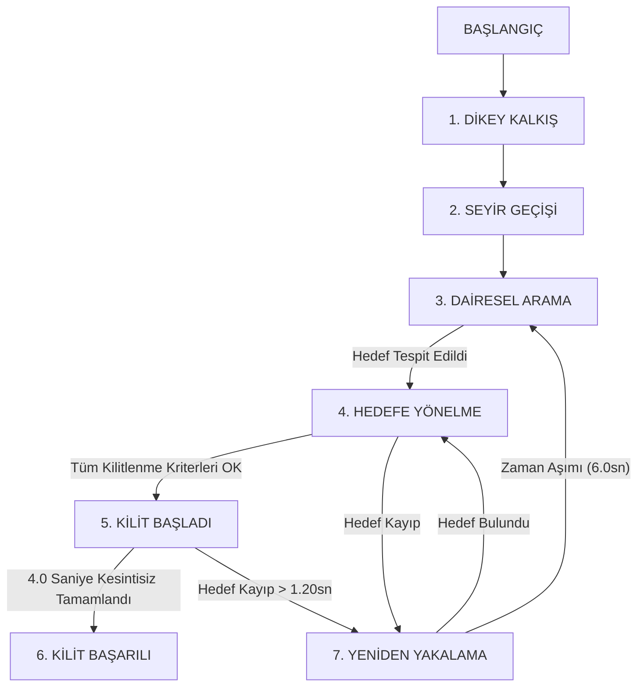
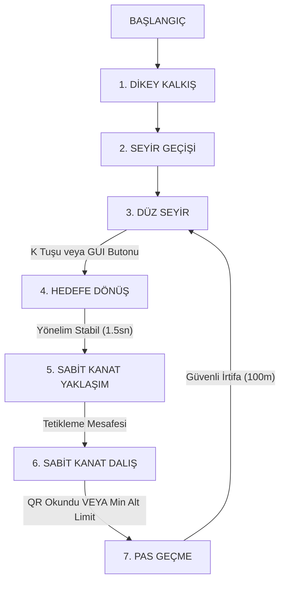

<h1 align="center">⚔️ TEKNOFEST Savaşan İHA ve Otonom Kamikaze Görevleri</h1>

<p align="center">
  
  
  
  
  
  
</p>

---

<br>

## Proje Hakkında

Bu proje, **TEKNOFEST Savaşan İHA Yarışması** için geliştirilmiş otonom takip/kilitlenme görevi ve otonom kamikaze görevi yazılım altyapılarını içermektedir.

Sistem testleri için dikey iniş kalkışlı **VTOL (Vertical Take-Off and Landing - QuadPlane)** tipi İHA modeli (`standard_vtol`) kullanılmıştır. Ancak projenin ana kodları tamamen modüler ve esnek bir yapıda geliştirilmiş olup, **farklı tipteki İHA'lar** (sabit kanat, döner kanat vb.) ile çalışabilecek mimariye sahiptir. Kendi kullanacağınız İHA modeline uygun olarak `config.yaml` ve `default.yaml` dosyalarındaki parametreleri düzenleyip, gerekirse araç kontrol kodlarını da kendi aracınızın fiziksel uçuş dinamiklerine göre güncelleyerek sistemi kendi platformunuzda kullanabilirsiniz.

---

<br>

## ⚔️ Savaşan İHA Görevi: Otonom Takip ve Kilitlenme

<h3 align="center">🎥 Görev Önizleme Demosu</h3>

<p align="center">
  <video src="https://github.com/user-attachments/assets/05d4527f-3d3c-40fb-8e78-58eaf5a41bcb" controls width="800"></video>
</p>

Savaşan İHA görevi; avcı İHA'nın havada serbestçe devriye gezen av İHA'yı (prey) tamamen otonom olarak arayıp bulmasını, ona güvenli mesafeden yaklaşarak arkasına yerleşmesini (mesafe koruması) ve yarışma şartnamesinde belirtilen 5 kritik kuralı kesintisiz 4.0 saniye boyunca sağlayarak otonom kilitlenme gerçekleştirmesini kapsar.

### 📋 Şartname Kuralları & Kilitlenme Kriterleri
Yarışma kurallarına göre başarılı bir otonom kilitlenme için aşağıdaki 5 şartın aynı anda ve kesintisiz olarak **4.0 saniye** boyunca sağlanması gerekmektedir:

> [!IMPORTANT]
> **1. Boyut Şartı (min\_target\_size\_ratio: %5)**
> Hedef İHA'nın genişliğinin veya yüksekliğinin, kamera ekranı (1280x720) boyutlarına oranı **en az %5 (`0.05`)** olmalıdır.
> *   *Profil Telafisi:* İHA'lar aynı irtifada uçarken yandan veya karşıdan çok ince (dar) bir kesit alanına sahiptir. Bu dar kesit alanını telafi etmek ve uçuş güvenliğini (aşırı yaklaşma riskini) korumak için `bbox_scale_factor: 0.80` parametresi eklenmiştir. Bu parametre, algılanan bbox boyutunu sanal olarak %80 oranında büyüterek kilitlenmenin daha güvenli bir mesafeden kurulmasını ve sürdürülmesini sağlar.

> [!NOTE]
> **2. Konum Şartı (Hedef Vuruş Alanı - `in\_target\_area`)**
> Hedef İHA'nın merkez noktası (`tcx, tcy`), ekranın ortasındaki **Hedef Vuruş Alanı** içinde bulunmalıdır. Bu alan ekranın kenarlarından kırpılarak oluşturulur (sağdan/soldan %25, alttan/üstten %10 boşluk: `target_area_margin_x: 0.25`, `target_area_margin_y: 0.10`). Yani hedef ekranın çok kenarlarındayken kilitlenme sayılmaz, merkezde olmalıdır.

> [!TIP]
> **3. Kilitlenme Alanı Şartı (Lock Zone - `in\_lock\_zone`)**
> Algoritmanın ürettiği kilitlenme dörtgeninin (kırmızı kutu) merkez koordinatı da yine yukarıda tanımlanan **Hedef Vuruş Alanı** sınırları içerisinde yer almalıdır.

> [!WARNING]
> **4. Kapsama Oranı Şartı (Coverage Ratio - `coverage\_ok`)**
> Algoritmanın ürettiği kilitlenme dörtgeni (AH), YOLO'nun tespit ettiği gerçek hedef kutusunun (H) **en az %90'ını** kapsamalıdır (`min_coverage_ratio: 0.90`). Kilit kutusu hedefi ıskalamamalı veya çok dışında kalmamalıdır.

> [!CAUTION]
> **5. Merkez Kayma Toleransı (Center Offset - `center\_offset\_ok`)**
> Hedef kutusunun gerçek merkezi ile kilitlenme dörtgeninin merkezi arasındaki piksel farkı (sapma), hedefin kendi boyutunun (genişlik/yükseklik) **en fazla yarısı (%50'si)** kadar olabilir (`max_center_offset_ratio: 0.5`). 
> *   *Esnek Tolerans:* Yapılan son güncelleme ile bu tolerans sınırı da `bbox_scale_factor` parametresine bağlı olarak yapay olarak daha esnek hale getirilmiştir, böylece ufak merkez kaymalarında kilitlenme hemen kopmaz.

---

<br>

### ⚙️ Savaşan İHA Durum Makinesi (State Machine)

Uçuş kontrol mekanizması ve otonom takip görevleri bir durum makinesi (State Machine) üzerinden yönetilir:



#### Durumların Detaylı Uçuş Algoritması:
1.  **TAKEOFF (Dikey Kalkış):** Avcı İHA, dikey motorlarını (VTOL) çalıştırarak kalkış yapar ve konfigüre edilen kalkış yüksekliğine (`takeoff_altitude_m` - Varsayılan: 100m) dikey olarak tırmanır.
2.  **TRANSITION (Seyir Moduna Geçiş):** Düz uçuş motorları devreye girer, dikey motorlar kapatılır ve İHA sabit kanat uçuş moduna geçer.
3.  **CIRCLE\_SEARCH (Dairesel Arama):** İHA, arama bölgesinin merkez koordinatları etrafında dairesel devriye uçuşuna (`GUIDED` loiter) başlar ve kamera görüntüsünden YOLO ile hedef araması gerçekleştirir.
4.  **INTERCEPT (Hedefe Yönelme & Takip):** Hedef tespit edildiği anda avcı İHA aktif takip moduna geçer. PID tabanlı servo yönlendirmesiyle burnunu hedefe çevirir ve hız PID kontrolcüsüyle av ile arasındaki mesafeyi kapatmaya başlar.
5.  **LOCK\_HOLD (Kilitlenme Süreci):** Tüm 5 kilitlenme kriteri sağlandığında 4.0 saniyelik sayaç başlar.
    *   *Kayıp Toleransı (Hold Grace Time - 1.20sn):* İHA manevra yaparken veya görüntü anlık olarak titrediğinde kilitlenmenin sıfırlanmasını önlemek amacıyla **1.20 saniyelik** esnek tolerans süresi uygulanır.
6.  **LOCK\_SUCCESS (Kilitlenme Başarılı):** 4.0 saniye kesintisiz takip başarıyla tamamlandığında sunucuya kilitlenme paketi gönderilir ve ekranda yeşil panel ile **"GOREV BASARILI"** uyarısı verilir.
7.  **REACQUIRE (Yeniden Yakalama):** Hedef anlık olarak kaybedilirse (örneğin 1.20 saniyeden uzun süren kayıplarda) İHA son bilinen konum, hız ve yön vektörünü EKF üzerinden kullanarak tahminî bir arama bölgesi (ROI) oluşturur ve kamerayı bu bölgeye odaklar. Hedef 6 saniye içinde tekrar bulunamazsa tekrar genel dairesel aramaya (`CIRCLE_SEARCH`) döner.

---

<br>

### 📐 Gelişmiş Algoritmik ve Kontrol Mimarisi

Sistem, nesne tespiti, durum kestirimi ve uçuş mekaniği kontrolünü uçtan uca bağlayan çok katmanlı, gelişmiş bir algoritmik mimariye sahiptir:

#### 1. Real-Time Hedef Algılama (YOLOv11 Deep Learning Detector)
*   **Derin Öğrenme Modeli:** Uçuş esnasında saniyede 20+ kare (FPS) işleme hızıyla hedef İHA'nın tespit edilmesi amacıyla **YOLOv11** (You Only Look Once) mimarisi entegre edilmiştir. 
*   **Önemli Prototiplendirme Notu:** 
    > [!WARNING]
    > Proje kapsamında sunulan ağırlık dosyası (`yolo`) Gazebo simülasyon ortamında testler gerçekleştirmek amacıyla eğitilmiş **hafif bir prototip/test modelidir**. Gerçek yarışma alanında ve fiziksel uçuşlarda; farklı ışık açıları, arka plan gürültüleri (bulut, yeryüzü şekilleri) ve uzun mesafe tespiti için bu modelin güvenilirliği düşük kalabilir.
    *   **Tavsiye:** Gerçek dünya uygulamalarında en az **YOLOv11s** veya **YOLOv11m** mimarisi kullanılarak, gerçek savaşan İHA görüntülerinden (farklı açılar, irtifalar ve hava koşulları altında) oluşturulmuş kapsamlı ve özgün bir veri kümesiyle (Custom Dataset) eğitilmiş daha gelişmiş bir modelin kullanılması şiddetle tavsiye edilir.

#### 2. Tek Hedefli Extended Kalman Filter (EKF) Tracker (Durum Kestirimi)
Görüntü düzleminde anlık tespit kayıplarını sönümlemek ve gürültülü YOLO kutularını filtrelemek amacıyla **Extended Kalman Filter (Genişletilmiş Kalman Filtresi)** tabanlı tek hedefli bir tracker mimarisi uygulanmıştır.
*   **State (Durum) Vektörü:** Durum uzayı 6 boyuttan oluşmaktadır:
    $$\mathbf{x} = \begin{bmatrix} x & y & u & v & w & h \end{bmatrix}^T$$
    Burada $(x, y)$ hedef merkez koordinatlarını, $(u, v)$ piksel/saniye cinsinden hedef hız vektörünü, $(w, h)$ ise hedef kutusunun genişlik ve yüksekliğini temsil eder.
*   **Dinamik Model:** Pozisyon durumları için sabit hızlı (Constant Velocity), boyutlar için ise sabit boyutlu (Constant Size) durum geçiş modeli uygulanır:
    $$\mathbf{x}\_{k} = F \mathbf{x}\_{k-1} + \mathbf{w}\_k$$
*   **Measurement (Ölçüm) Vektörü & Gating:** Ölçüm vektörü doğrudan YOLO'nun tespit ettiği $\mathbf{z} = [x, y, w, h]^T$ kutusudur. Hatalı ve gürültülü tespitlerin (yanlış alarmlar) Kalman filtresine dahil edilip sistemi bozmaması amacıyla **Mahalanobis Mesafe Eşiği (Gating - 200 piksel)** uygulanmıştır. Eşiğin dışındaki tespitler filtreye sokulmadan elenir.
*   **Tahminî Takip (Coasting):** Kamera kadrajından hedefin anlık olarak çıktığı veya YOLO'nun tespiti kaçırdığı frame'lerde EKF kendi hız tahmini (`u, v`) ile hedef konumunu saniyede 25 kez güncellemeye devam eder (`COASTING` durumu). Böylece takip kesintiye uğramaz ve kilitlenme sayacı sıfırlanmaz.

#### 3. Görsel Servo (Visual Servoing) ve PID Kontrol Mimarisi
Görüntü düzlemindeki piksel sapmalarını hava aracının fiziksel yönelim ve irtifa komutlarına çeviren bir görsel servo algoritması çalışır:
*   **Açısal Projeksiyon:** Merkez piksel hataları ($e\_x, e\_y$), kameranın yatay ($FOV\_h = 110^{\circ}$) ve dikey ($FOV\_v = 75^{\circ}$) görüş açıları kullanılarak gerçek derece cinsinden açı hatalarına ($\theta\_{\text{yaw}}, \theta\_{\text{pitch}}$) projekte edilir:
    $$\theta\_{\text{yaw}} = \frac{c\_x - c\_{x,\text{mid}}}{c\_{x,\text{mid}}} \times \frac{FOV\_h}{2}$$
*   **Sanal İrtifa Kestirimi:** Bbox genişlik oranı ($w\_r = w / \text{frame\_width}$) kullanılarak av aracına olan yaklaşık geometrik mesafe ($d\_{est}$) hesaplanır. Ardından dikey pitch açı hatasıyla trigonometrik olarak irtifa farkı ($h\_{err}$) elde edilir:
    $$h\_{err} = d\_{est} \times \sin(\theta\_{\text{pitch}})$$
*   **Çift PID Döngüsü:** 
    *   **Yatay Kontrol:** Yatay açı hatası, agresif bir PID kontrolcüsüne (`yaw_kp: 5.5`, `yaw_kd: 6.0`) beslenerek saniyede en fazla 65 dereceye kadar yatay açısal dönüş komutu (`yaw_rate`) üretir.
    *   **Dikey Kontrol:** Hesaplanan irtifa farkı ($h\_{err}$), dikey PID döngüsüne (`alt_kp: 4.0`, `alt_kd: 2.0`) sokularak dikey tırmanış/alçalış hızını (`vz` - m/s) üretir.

#### 4. Logaritmik Mesafe Kontrolü ve Hız Profilleme
Avcı İHA'nın avı arkadan takip ederken aşırı hızlanıp onu geçmesini (fly-past) önlemek amacıyla logaritmik mesafe kontrolü uygulanır:
*   **Logaritmik Hata Kontrolü:** Mesafe hatası, hedef ve anlık genişlik oranlarının logaritmik farkı üzerinden hesaplanır:
    $$e\_{dist} = \ln\left(\frac{w\_{desired}}{w\_{current}}\right)$$
*   **Senkronize Hız Profilleme:** Takip esnasında mesafe PID'sinden gelen hız çıktısı, `bbox_scale_factor` ile büyütülmüş sanal genişlik oranına göre filtrelenerek 5 farklı aşamada (Çok Uzak ➔ Uzak ➔ Orta Mesafe ➔ Hedef Mesafe ➔ Çok Yakın) hız limitlerine (`commanded_speed`) tabi tutulur. Av kilitlenme mesafesine girdiğinde hız **6.0 - 8.0 m/s** av hızına (hatta aşırı yakınsa **5.0 m/s**'ye) sabitlenerek güvenli mesafe korunur.
*   **İvme ve Açısal Sınırlandırıcılar (Slew Limiting):** Aracın aerodinamik yapısının bozulmasını veya autopilotun çökmesini engellemek için üretilen hız ve açısal komutlar saniye başına maksimum değişim oranlarıyla (`max_speed_delta`, `max_yaw_delta`) yumuşatılarak ArduPilot'a gönderilir.

---

<br>

## 🎯 Kamikaze İHA Görevi ve Şartname Gereksinimleri

<h3 align="center">🎥 Görev Önizleme Demosu</h3>

<p align="center">
  <video src="https://github.com/user-attachments/assets/0b897603-f90d-4f7a-a46d-a202249760b8" controls width="800"></video>
</p>

Yarışma şartnamesine göre Kamikaze İHA görevi; yer düzleminde sabit bir konumda bulunan **2m x 2m** boyutlarındaki bir QR kod hedefinin İHA üzerindeki kamera ile otonom olarak tespit edilmesini, okunmasını ve ardından İHA'nın güvenli bir şekilde pas geçerek (tırmanışa geçerek) uçuşuna devam etmesini kapsar.

### 📋 Şartname Kuralları & Görev Tanımı
*   **Fiziki Çarpma Yasaktır:** İHA'nın hedef platforma fiziki olarak çarpması yasaktır. Amaç, dalış gerçekleştirip QR kodu kamerayla okumak ve güvenli bir irtifada pas geçmektir.
*   **Dalış Başlangıç İrtifası:** Şartname gereğince dalışa başlama irtifası, kalkış pistine göreli olarak **en az 100 metre** olmalıdır.
*   **Açılı Koruma Panelleri:** QR kodun düz uçuş (cruise) esnasında uzaktan ve düz karşıdan okunmasını engellemek amacıyla etrafı **3 metre yüksekliğinde ve 45 derece açılı** plakalarla çevrilmiştir. Bu nedenle İHA, yukarıdan belirli bir süzülüş açısıyla (glide slope) dalış yapmak zorundadır.
*   **Hedef Vuruş Alanı (Target Hit Area):** Dalışın sonlandığı (QR kodun okunduğu veya dalıştan çıkıldığı) andan 1 saniye önce ve 1 saniye sonraki (toplam 2 saniyelik) zaman diliminde, kameradan alınan en az 1 karede QR kod sınırlarının tamamı ekranın ortasındaki hedef vuruş alanı sınırları içerisinde olmalı ve en az 1 karede QR kod başarıyla çözülmüş olmalıdır.

---

<br>

### ⚙️ Kamikaze İHA Durum Makinesi (State Machine)

Uçuş kontrol mekanizması bir durum makinesi (State Machine) üzerinden otonom olarak yönetilir:



#### Durumların Detaylı Analizi ve Uçuş Algoritması:

1.  **TAKEOFF (Dikey Kalkış):** İHA, `GUIDED` modda dikey motorlarını (VTOL) çalıştırarak kalkış yapar ve konfigüre edilen kalkış yüksekliğine (`takeoff_altitude_m` - Varsayılan: 150m) dikey olarak tırmanır.
2.  **TRANSITION (Seyir Moduna Geçiş):** Kalkış tamamlandıktan sonra uçuş kontrolörü, kalkış yapılan konumu (veya konfigürasyondaki hedef koordinatlarını) hedef olarak kaydeder ve süzülüş/dalış parametrelerini hesaplamak üzere `DiveGuidance` sistemini başlatır.
3.  **CRUISE\_FORWARD (Seyir Uçuşu):** İHA belirlenen seyir irtifasında (`cruise_altitude_m` - Varsayılan: 150m) düz ileri uçuş gerçekleştirir. Operatör OpenCV arayüzündeki **"START KAMIKAZE"** butonuna tıklayana veya klavyeden **"K"** tuşuna basana kadar bu durumda bekler.
4.  **TURN\_TO\_TARGET (Hedefe Yönelme):** Kamikaze görevi başlatıldığında İHA, `GUIDED` modda hedef koordinatına doğru keskin bir U dönüşü yapar. İHA'nın yönelimi (heading), hedef açısı toleransı (`heading_tolerance_deg`) içinde **1.5 saniye** boyunca kararlı kaldığında yönelim kilitlenir ve bir sonraki aşamaya geçilir.
5.  **FW\_APPROACH (Sabit Kanat Yaklaşımı):** İHA dalış kapısına yaklaşırken erken irtifa kayıplarını önlemek amacıyla dalış sınırına (`fixed_wing_dive_arm_distance_m`) kadar `GUIDED` modda irtifasını korur. Bu sınırın altına girildiğinde sabit kanat uçuş moduna (`FBWA`) geçiş yapılır. Geçişten sonra aerodinamik kararlılık için kısa bir süre motor gücü ve kontrol yüzeyleri dengelenir.
6.  **FW\_DIVE (Dalış Aşaması):** İHA, otomatik olarak hesaplanan tetikleme mesafesine ulaştığında burun aşağı dalışa (`FW_DIVE`) geçer.
    *   **Glide Slope (Süzülüş Hattı) PI Kontrolcü:** Dalış esnasında İHA'nın ideal süzülüş hattından sapmasını engellemek için anlık irtifa hatası (`alt_error`) kullanılarak bir PI kontrolcü çalıştırılır. Kontrolcü, `pitch_pwm` sinyalini modüle ederek İHA'nın süzülüş açısını sabit tutar.
    *   **Yanal Sapma Engelleme:** Dalış sırasında İHA'nın hedeften sağa-sola savrulmaması için roll kanalları sınırlandırılır (`dive_roll_limit_pwm`) ve İHA sadece küçük yön düzeltmeleriyle düz bir doğrultuda hedefe süzülür.
7.  **PULLUP (Pas Geçme / Tırmanma):** QR kod başarıyla deşifre edildiğinde veya İHA emniyet limitine (`dive_recovery_altitude_m` - 25m / minimum 20m) ulaştığında dalış derhal durdurulur. İHA dikey motorlarını açarak (`transition_to_guided_vtol` ile) hızlıca tırmanışa geçer. `pullup_target_altitude_m` (100m) yüksekliğine ulaştığında tekrar emniyetli seyir uçuşuna (`CRUISE_FORWARD`) geri döner.

---

<br>

## 🛠️ Simülasyon Ortamı ve Proje Kurulumu

### Ön Gereksinimler
Docker tabanlı simülasyon ortamı için kurulum adımları **[ArduGazeboSim-Docker](https://github.com/koesan/ArduGazeboSim-Docker)** deposundaki dokümantasyon takip edilerek gerçekleştirilmelidir. Bu kurulum; ROS paketleri, ArduPilot SITL ve Gazebo simülasyon ortamının tüm bağımlılıklarını otomatik olarak yapılandırır.

### 1. Sistem Bağımlılıklarının Kurulması
`PyZBar` kütüphanesinin çalışabilmesi için gerekli sistem kütüphanelerini kurun ve Python paketlerini yükleyin:

```bash
# Sistem kütüphanelerini güncelleyin ve libzbar paketlerini yükleyin
sudo apt-get update
sudo apt-get install -y libzbar0 libzbar-dev

# Gerekli Python kütüphanelerini yükleyin
pip install -r requirements.txt
```

### 2. Simülasyon Dosyalarının Kopyalanması

#### A. Kamikaze İHA Görevi Simülasyon Modelleri ve Dünyası
Proje klasöründeki özel modelleri ve dünyayı Gazebo simülasyon ortamına (catkin çalışma alanına) kopyalayın:

```bash
# Simülasyon modellerini kopyalayın
cp -rf ./Kamikaze_İHA_Görevi/similasyon/kamikaze_qr_target ./catkin_ws/src/iq_sim/models/
cp -rf ./Kamikaze_İHA_Görevi/similasyon/standard_vtol ./catkin_ws/src/iq_sim/models/

# Dünyayı (World) kopyalayın (Varsa üzerine yazar)
cp -f ./Kamikaze_İHA_Görevi/similasyon/multi_drone.world ./catkin_ws/src/iq_sim/worlds/
```

#### B. Savaşan İHA Görevi Simülasyon Modelleri ve Dünyası
```bash
# Simülasyon modellerini kopyalayın
cp -rf ./Savaşan_İHA_Görevi/similasyon/standard_vtol_1 ./catkin_ws/src/iq_sim/models/
cp -rf ./Savaşan_İHA_Görevi/similasyon/standard_vtol_2 ./catkin_ws/src/iq_sim/models/

# Dünyayı (World) kopyalayın (Eğer multi_drone.world yoksa kopyalar)
cp -n ./Savaşan_İHA_Görevi/similasyon/multi_drone.world ./catkin_ws/src/iq_sim/worlds/
```

### 3. ArduPilot Yapılandırması ve Parametre Tanımlamaları
Gazebo QuadPlane modellerinin ArduPilot SITL tarafından tanınması için `vehicleinfo.py` dosyasına `"gazebo-quadplane"` profilinin eklenmesi gerekmektedir. Hazır yapılandırılmış dosyaları ilgili ArduPilot klasörlerine kopyalayın:

#### A. Kamikaze İHA Yapılandırması
```bash
# Hazır parametre dosyasını default_params klasörüne kopyalayın
cp ./Kamikaze_İHA_Görevi/similasyon/gazebo_quadplane.parm ./ardupilot/Tools/autotest/default_params/gazebo_quadplane.parm

# vehicleinfo.py dosyasını güncelleyin (gazebo-quadplane profilini içerir)
cp ./Kamikaze_İHA_Görevi/similasyon/vehicleinfo.py ./ardupilot/Tools/autotest/pysim/vehicleinfo.py
```

#### B. Savaşan İHA Yapılandırması
```bash
# Hazır parametre dosyasını default_params klasörüne kopyalayın
cp ./Savaşan_İHA_Görevi/similasyon/gazebo_quadplane.parm ./ardupilot/Tools/autotest/default_params/gazebo_quadplane.parm

# vehicleinfo.py dosyasını güncelleyin (gazebo-quadplane profilini içerir)
cp ./Savaşan_İHA_Görevi/similasyon/vehicleinfo.py ./ardupilot/Tools/autotest/pysim/vehicleinfo.py
```

> [!NOTE]
> `vehicleinfo.py` içindeki ekleme `ArduPlane` yapısı altında şu şekilde tanımlanmıştır:
> ```python
> "gazebo-quadplane": {
>     "waf_target": "bin/arduplane",
>     "default_params_filename": "default_params/gazebo_quadplane.parm",
> },
> ```

---

<br>

## 🚀 Sistemi Çalıştırma Adımları

Uygulamak istediğiniz göreve göre aşağıdaki adımları sırasıyla gerçekleştiriniz:

### 🎯 Seçenek A: Kamikaze İHA Görevi Çalıştırma
Görevi çalıştırmak için sırasıyla **3 ayrı terminal** açmanız gerekmektedir:

#### 1. Terminal: Gazebo Simülasyonunu Başlatma
```bash
roslaunch iq_sim multi_drone.launch
```

#### 2. Terminal: ArduPilot SITL Bağlantısını Kurma
```bash
sim_vehicle.py -v ArduPlane -f gazebo-quadplane --no-mavproxy -I0
```

#### 3. Terminal: Görev Kontrol Yazılımını Başlatma
```bash
cd ./Teknofest_savaşan_iha/Kamikaze_İHA_Görevi/
python3 main.py
```

---

### ⚔️ Seçenek B: Savaşan İHA Görevi Çalıştırma (Otonom Takip ve Kilitlenme)
Görevi çalıştırmak için sırasıyla **4 ayrı terminal** açmanız gerekmektedir:

#### 1. Terminal: Gazebo Simülasyonunu Başlatma (Çoklu Drone Dünyası)
```bash
roslaunch iq_sim multi_drone.launch
```

#### 2. Terminal: ArduPilot SITL 1. Drone Bağlantısını Kurma (Avcı İHA - Hunter)
```bash
sim_vehicle.py -v ArduPlane -f gazebo-quadplane --no-mavproxy -I0
```

#### 3. Terminal: ArduPilot SITL 2. Drone Bağlantısını Kurma (Av İHA - Prey)
```bash
sim_vehicle.py -v ArduPlane -f gazebo-quadplane --no-mavproxy -I1
```

#### 4. Terminal: Görev Kontrol Yazılımını Başlatma
```bash
cd ./Teknofest_savaşan_iha/Savaşan_İHA_Görevi/
python3 main.py
```

---

<br>

## ⚙️ Önemli Konfigürasyon Parametreleri (`config.yaml` & `default.yaml`)

Tüm sistem parametreleri ilgili klasörlerdeki konfigürasyon dosyalarından yönetilir.

### A. Kamikaze İHA Görevi Parametreleri (`Kamikaze_İHA_Görevi/config.yaml`)

| Parametre Grubu | Değişken Adı | Varsayılan Değer | Açıklama |
| :--- | :--- | :--- | :--- |
| **vehicle** | `takeoff_altitude_m` | `150.0` | Otonom kalkışta çıkılacak hedef irtifa (metre) |
| | `cruise_altitude_m` | `150.0` | Seyir uçuşu gerçekleştirilecek irtifa (metre) |
| | `cruise_speed_mps` | `18.0` | Seyir uçuşu hızı (m/s) |
| | `min_safe_altitude_m` | `20.0` | Kritik güvenlik irtifa limiti (metre) |
| **mission** | `effective_dive_angle_deg` | `18.0` | Dalış mesafesi hesabı için süzülüş açısı (derece) |
| | `dive_angle_deg` | `30.0` | Dalış esnasında hedeflenen fiziki dalış açısı (derece) |
| | `dive_recovery_altitude_m` | `25.0` | Dalıştan çıkış (pull-up/pas geçme) tetikleme irtifası (metre) |
| | `pullup_target_altitude_m` | `100.0` | Pas geçtikten sonra tırmanılacak güvenli irtifa (metre) |
| | `target_offset_m` | `8.0` | QR hedefine olan yatay ofset mesafesi (metre) |
| **camera** | `primary_topic` | `/uav1/camera_front/image_raw` | ROS Kamera görüntüsü topic adı |

<br>

### B. Savaşan İHA Görevi Parametreleri (`Savaşan_İHA_Görevi/config/default.yaml`)

| Parametre Grubu | Değişken Adı | Varsayılan Değer | Açıklama |
| :--- | :--- | :--- | :--- |
| **lock** | `min_target_size_ratio` | `0.05` | Kilitlenme için minimum hedef en/boy oranı (%5) |
| | `bbox_scale_factor` | `0.80` | Kesit alanı dar profil telafisi için yapay bbox büyüme oranı (%80) |
| | `required_lock_duration` | `4.0` | Kilitlenmenin başarılı sayılması için gereken süre (saniye) |
| | `hold_grace_time` | `1.20` | Anlık kayıpları tolere eden esnek tolerans süresi (saniye) |
| | `target_area_margin_x` | `0.25` | Hedef vuruş alanı için sol/sağ ekran kırpma oranı (%25) |
| | `target_area_margin_y` | `0.10` | Hedef vuruş alanı için üst/alt ekran kırpma oranı (%10) |
| **control** | `desired_width_ratio` | `0.055` | İHA'nın avın arkasında korumak istediği hedef mesafe oranı |
| | `yaw_kp` / `yaw_kd` | `5.5` / `6.0` | Yönelim PID kazançları (Görsel Servo) |
| | `alt_kp` / `alt_kd` | `4.0` / `2.0` | İrtifa PID kazançları |
| | `fwd_kp` | `3.5` | Mesafe/hız PID kazancı |

<br>

> [!NOTE]
> **💡 Kilitlenme Genişletme Faktörü (`bbox_scale_factor`) Kullanımı:**
> *   `0.80` varsayılan değeri, algılanan hedef İHA kutusunu sanal olarak **%80 oranında büyüterek** (yani `1.80` katı) dar gövde kesitlerinde kilitlenme kriterinin erkenden sağlanmasını kolaylaştırır.
> *   Eğer yapay büyütme yapılmasını istemiyorsanız ve tamamen **ham YOLO tespit kutusu** ile şartname kontrolü gerçekleştirmek istiyorsanız, bu parametreyi `0.0` yapmanız yeterlidir. Bu durumda sistem %100 orijinal YOLO çıktılarını baz alacaktır.
